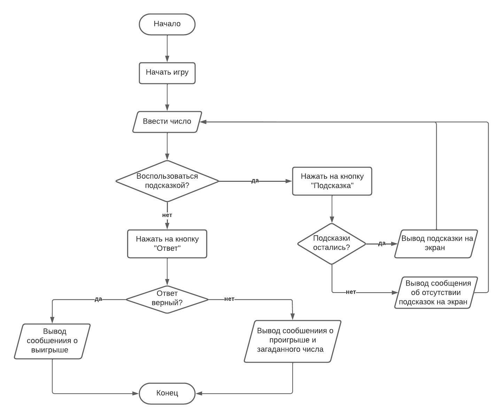

# Игра "Угадай число"

## Алгоритм

Ниже представлена схема алгоритма программы

Прокомментируем данную схему, описав действия:

- После запуска программы пользователь начинает игру.
- После начала игры компьютер загадывает число, и пользователь может ввести число в поле ввода
- После ввода числа пользователю доступен выбор: воспользоваться подсказкой или сразу ввести ответ
  - Пользователь выбирает подсказку
    - Если подсказок не осталось, программа выводит сообщение об отсутствии подсказок у пользователя
    - Если подсказки есть, программа выводит подсказку
  - Пользователь выбирает действие "Ответ"
    - Если введённое число совпадает с загаданным, то выводится сообщение о выигрыше
    - Если введённое число не совпадает с зашаданными, то выводится сообщение о проигрыше и само загаданное число
- Игра завершается

[Вернуться назад](../README.md)
