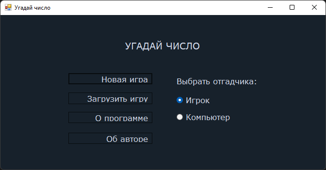

# Игра "Угадай число"

## Руководство пользователя

### Перечень сокращений

- ПП - программный продукт
- ПК - персональный компьютер

### Аннотация

В данном документе приводятся сведения, необходимые для успешной эксплуатации программы «Игра "Угадай число"».

### 1.) Введение

ПП «Игра "Угадай число"» представлен в виде графической реализации игры "Угадай число". Цель игры - угадать число с ограниченным числом подсказок.
Для эксплуатации программы требуется один оператор, обладающий навыками пользователя ПК.
Прежде чем начать работу с данной программой пользователь должен ознакомиться с руководством пользователя

### 2.) Общие сведения

ПП «Игра "Угадай число"» предназначен для выполнения следующих функций:

- Задания и редактирования входных данных в наборном поле диалогового окна c клавиатуры или с помощью стандартных для Windows операций Undo, Cut, Copy, Paste, Delete, SelectAll
- Выбора фокуса в диалоговом окне стандартными для Windows способами (мышью, клавишами Tab/Shift+Tab)
- Загадывания (генерации) случайного числа в диапазоне от 1 до 1000
- Индикации результатов обработки входных данных на экране в виде метки (элемент "label")
- Осуществления контроля вводимой информации и блокировки некорректных действий пользователя при попытке ввести нечисловые символы, а также при попытке запуска преобразования при пустом наборном поле

### 3.) Необходимые программные и аппаратные средства

Для функционирования программы необходимы требуются следующие аппаратные средства:

- Процессор с частотой 1,3 ГГц и выше
- Оперативная память от 512 Мб
- Видеокарта и монитор с разрешением не менее 1024 х 768
- Клавиатура, мышь

Для успешного функционирования программы необходима операционная среда Windows 7 и выше.

Программа расположена на носителе CD-ROM или с USB флеш-накопитель в виде загрузочного модуля `GuessTheNumber.exe`.

### 4.) Установка

Установка (инсталляция) программы не требуется.

### 5.) Загрузка и запуск

Исполнительный модуль программы `GuessTheNumber.exe` загружается в выбранную папку с диска CD-ROM или с USB флеш-накопителя и запускается одним из стандартных методов.

### 6.) Описание интерфейса пользователя

Интерфейс пользователя состоит из нескольких модулей:

- Главное меню
- Меню игры

Ниже представлен скриншот меню.

Справа можно выбрать, кто будет играть - игрок или компьютер.

Пункт "Об авторе" содержит информацию об авторе ПП (скриншот представлен ниже).

Пункт "О программе" содержит информацию о программе (скриншот представлен ниже).

Пункт "Загрузить игру" предназначен для загрузки ранее сохранённой игры. При нажатии на данный пункт появляется диалоговое окно для выбора .txt файлы (скриншот представлен ниже)

Пункт "Новая игра" предназначен для запуска нового сеанса игры (скриншот представлен ниже).

### 7.) Инструкции по работе

Для того, чтобы начать игру, необходимо нажать на кнопку "Новая игра". Заметим, что по умолчанию стоит "Игрок" в качестве отгадчика, т.е. вводить числа будет реальный игрок с помощью клавиатуры и мыши. Рассмотрим игру, когда в качестве отгадчика выступает "Игрок". Программа загадывает число с помощью датчика случайных чисел от 1 до 1000. Слева расположен счетчик подсказок. Для того, чтобы воспользоваться подсказкой, необходимо сначала ввести число в поле “Подсказка” и нажать на кнопку “Подсказка”. После выведется подсказка (скриншот представлен ниже).

При этом обратите внимание на счетчик подсказок. Стрелка теперь указывает на цифру "9", что даёт понять, что можно воспользоваться подсказкой ещё 9 раз. Чтобы попытаться угадать число, нужно ввести число в поле ввода “Ответ” и нажать на соответствующую кнопку. После ввода ответа независимо от исхода игры игра заканчивается.

Программа предусматривает возможность сохранения текущего сеанса игры в текстовый файл. Для этого нужно нажать на кнопку "Сохранить" (скриншот представлен ниже).

Теперь рассмотрим случай, когда в качестве отгадчика выступает компьютер. Пользователю доступна только одна кнопка "Продолжить" (не считая кнопки "Сохранить"), при нажатии на которую осуществляется шаг игры – компьютер пользуется подсказкой. В конечном итоге компьютер всегда угадывает число (скриншот представлен ниже).

Происходит это благодаря алгоритму бинарного поиска, который применяет компьютер в качестве инструмента для угадывания числа. Данный алгоритм заключается в сокращении диапазона поиска вдвое. Например, известно, что число находится в диапазоне от 1 до 1000. Тогда компьютер пользуется подсказкой типа “Загаданное число больше, чем…” и в качестве числа указывает целое число от деления на два суммы начального и конечного значений промежутка, т.е. 500. Если загаданное число больше 500, то промежуток поиска будет [1; 500], иначе [500; 1000] и так далее. 10 подсказок достаточно для того, чтобы отгадать загаданное число в диапазоне [1; 1000]

[Вернуться назад](../README.md)
