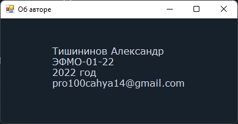

# Игра "Угадай число"

## Руководство пользователя

### Перечень сокращений

- ПП - программный продукт
- ПК - персональный компьютер

### Аннотация

В данном документе приводятся сведения, необходимые для успешной эксплуатации программы «Игра "Угадай число"».

### 1.) Введение

ПП «Игра "Угадай число"» представлен в виде графической реализации игры "Угадай число". Цель игры - угадать число с ограниченным числом подсказок.
Для эксплуатации программы требуется один оператор, обладающий навыками пользователя ПК.
Прежде чем начать работу с данной программой пользователь должен ознакомиться с руководством пользователя

### 2.) Общие сведения

ПП «Игра "Угадай число"» предназначен для выполнения следующих функций:

- Задания и редактирования входных данных в наборном поле диалогового окна c клавиатуры или с помощью стандартных для Windows операций Undo, Cut, Copy, Paste, Delete, SelectAll
- Выбора фокуса в диалоговом окне стандартными для Windows способами (мышью, клавишами Tab/Shift+Tab)
- Загадывания (генерации) случайного числа в диапазоне от 1 до 1000
- Индикации результатов обработки входных данных на экране в виде метки (элемент "label")
- Осуществления контроля вводимой информации и блокировки некорректных действий пользователя при попытке ввести нечисловые символы, а также при попытке запуска преобразования при пустом наборном поле

### 3.) Необходимые программные и аппаратные средства

Для функционирования программы необходимы требуются следующие аппаратные средства:

- Процессор с частотой 1,3 ГГц и выше
- Оперативная память от 512 Мб
- Видеокарта и монитор с разрешением не менее 1024 х 768
- Клавиатура, мышь

Для успешного функционирования программы необходима операционная среда Windows 7 и выше.

Программа расположена на носителе CD-ROM или с USB флеш-накопитель в виде загрузочного модуля `GuessTheNumber.exe`.

### 4.) Установка

Установка (инсталляция) программы не требуется.

### 5.) Загрузка и запуск

Исполнительный модуль программы `GuessTheNumber.exe` загружается в выбранную папку с диска CD-ROM или с USB флеш-накопителя и запускается одним из стандартных методов.

### 6.) Описание интерфейса пользователя

Интерфейс пользователя состоит из нескольких модулей:

- Главное меню
- Меню игры

Ниже представлен скриншот меню.

Пункт "Об авторе" содержит информацию об авторе ПП (скриншот представлен ниже).

Пункт "О программе" содержит информацию о программе (скриншот представлен ниже).

[Вернуться назад](../README.md)
