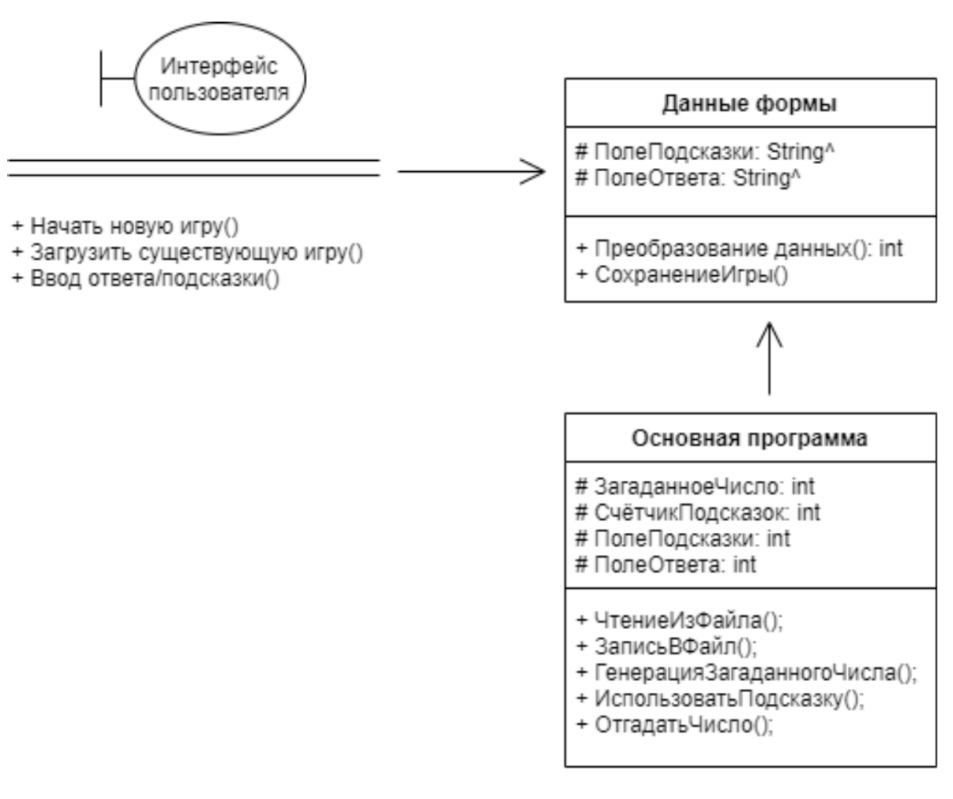

# Игра "Угадай число"

## Схема работы

Схема работы представлена в виде диаграммы классов

Прокомментируем данную схему. В программе можно выделить три основных модуля: интерфейс пользователя, основная программа и данные формы. Интерфейс пользователя осуществляет взаимодействие пользователя с программой. Данные формы - модуль-промежуточное хранилище введённых пользователем данных, которые обрабатывает модуль "Основная программа".

[Вернуться назад](../README.md)
